# mocp-themes
My collection of themes for the music on console player

## 30equals

```
mocp -T 30equals 
```
<p align="center">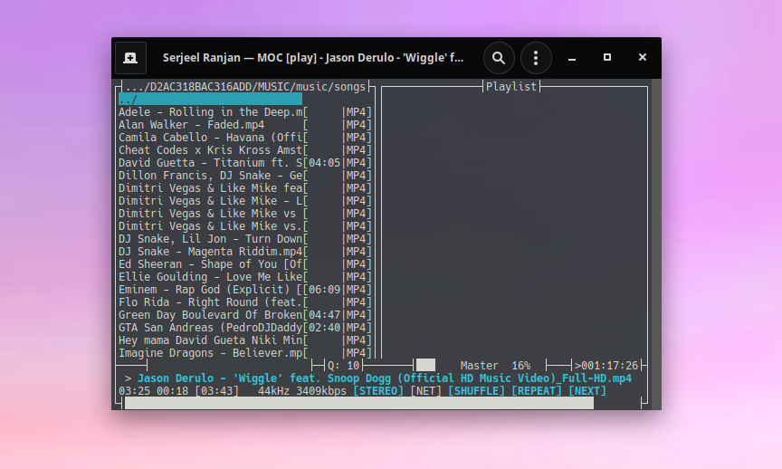</p>

## alldefault

```
mocp -T alldefault 
```
<p align="center">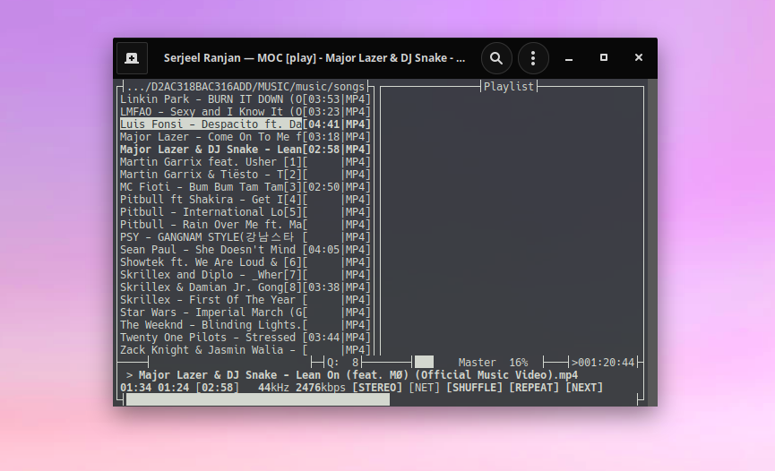</p>

## alpha_green

```
mocp -T alpha_green 
```
<p align="center">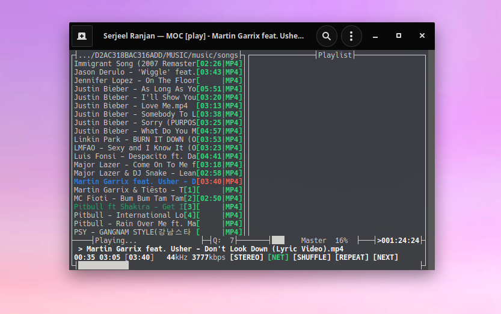</p>

## black_orange

```
mocp -T black_orange 
```
<p align="center">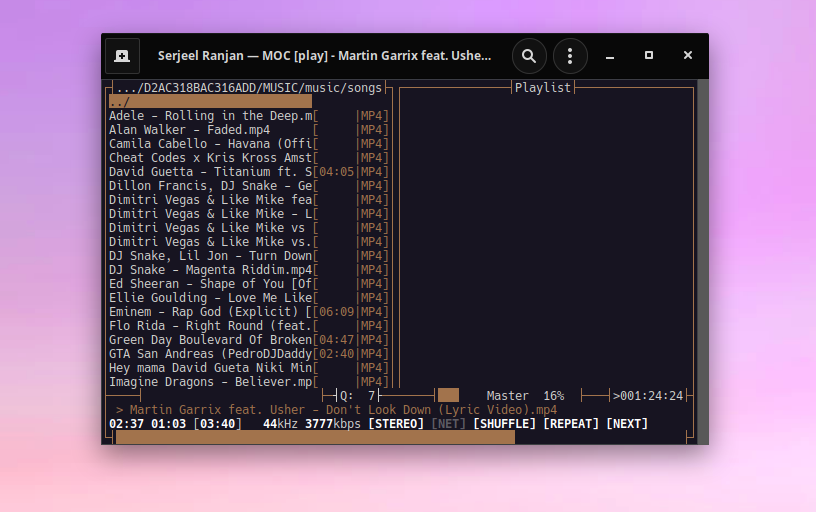</p>

## black_red_white

```
mocp -T black_red_white 
```
<p align="center">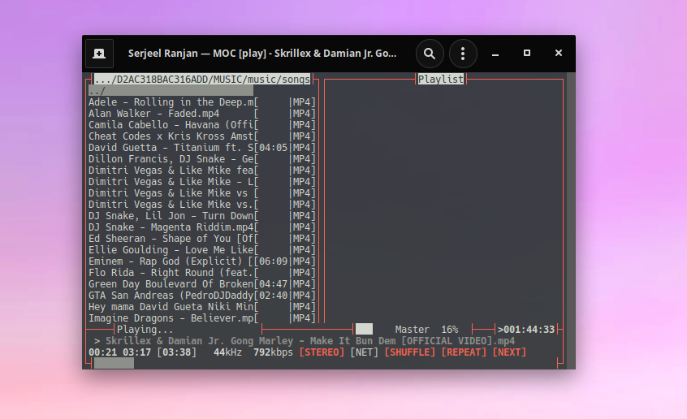</p>

## deephouse

```
mocp -T deephouse 
```
<p align="center">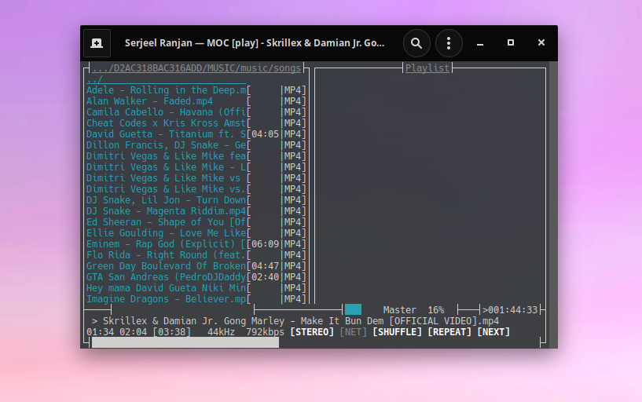</p>

## dylanwh

```
mocp -T dylanwh 
```
<p align="center">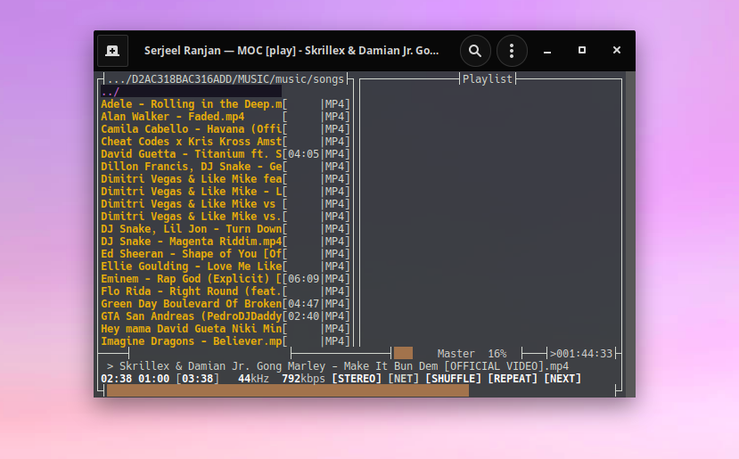</p>

## hybrid

```
mocp -T hybrid 
```
<p align="center">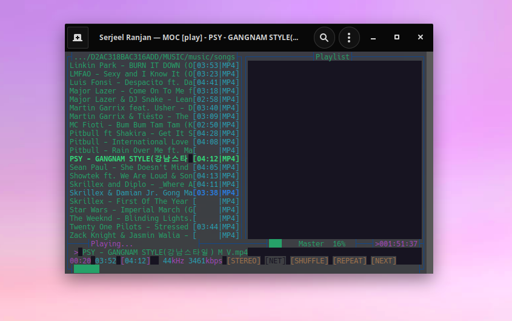</p>

## hybrid-bright

```
mocp -T hybrid-bright 
```
<p align="center"></p>

## lcd

```
mocp -T lcd 
```
<p align="center">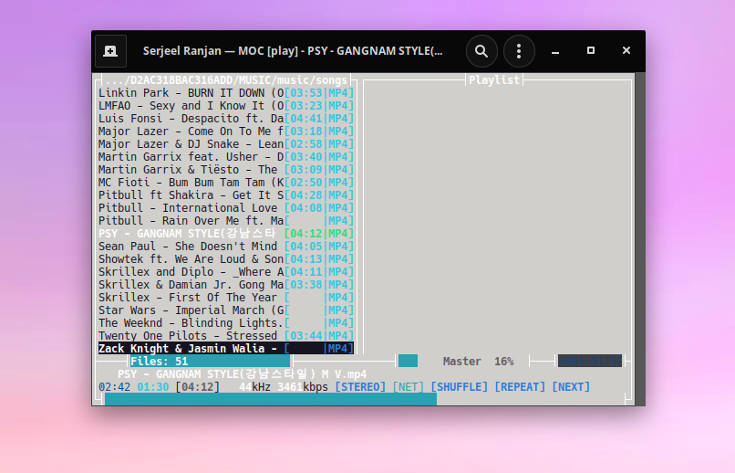</p>

## mostly_green

```
mocp -T mostly_green 
```
<p align="center">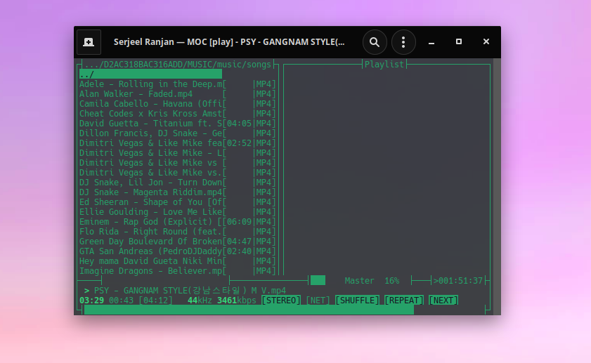</p>

## nes

```
mocp -T nes 
```
<p align="center">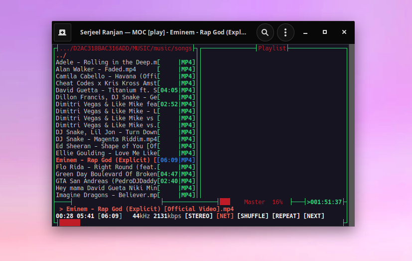</p>

## nightly_enhanced

```
mocp -T nightly_enhanced 
```
<p align="center">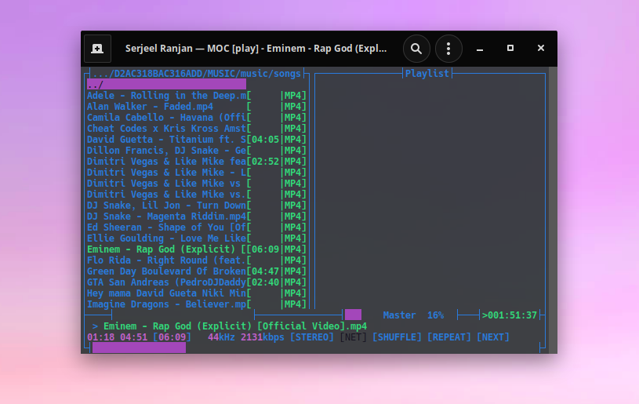</p>

## nightshade

```
mocp -T nightshade 
```
<p align="center"></p>

## orange

```
mocp -T orange 
```
<p align="center"></p>

## orpheus

```
mocp -T orpheus 
```
<p align="center">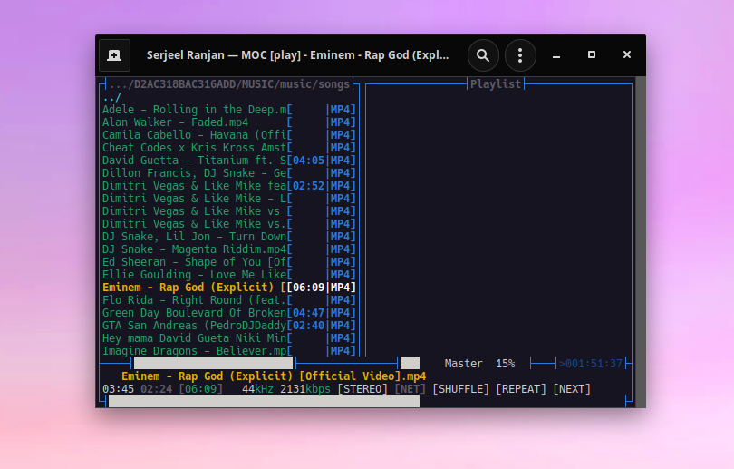</p>

## paper_blue

```
mocp -T paper_blue 
```
<p align="center">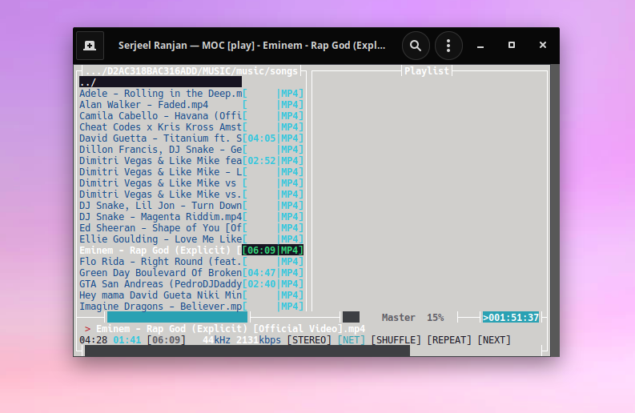</p>

## paper_white

```
mocp -T paper_white 
```
<p align="center">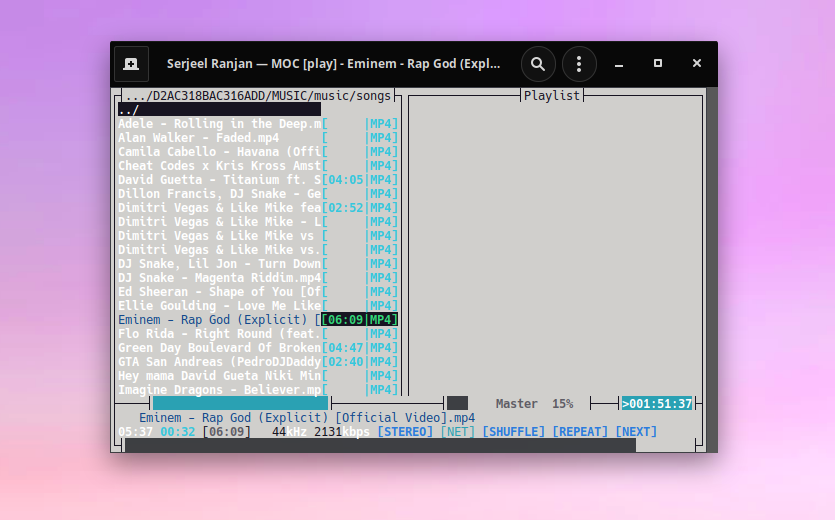</p>

## rhowaldt

```
mocp -T rhowaldt 
```
<p align="center">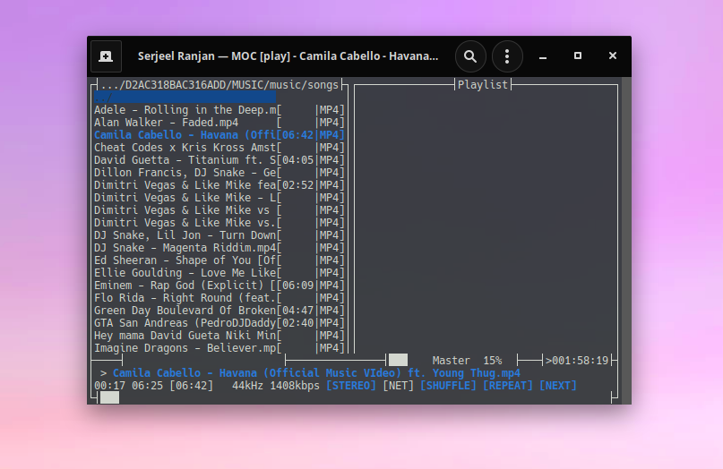</p>

## rteff_theme

```
mocp -T rteff_theme 
```
<p align="center">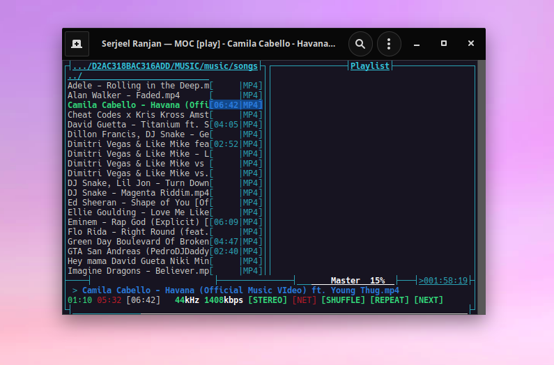</p>

## solarized

```
mocp -T solarized 
```
<p align="center">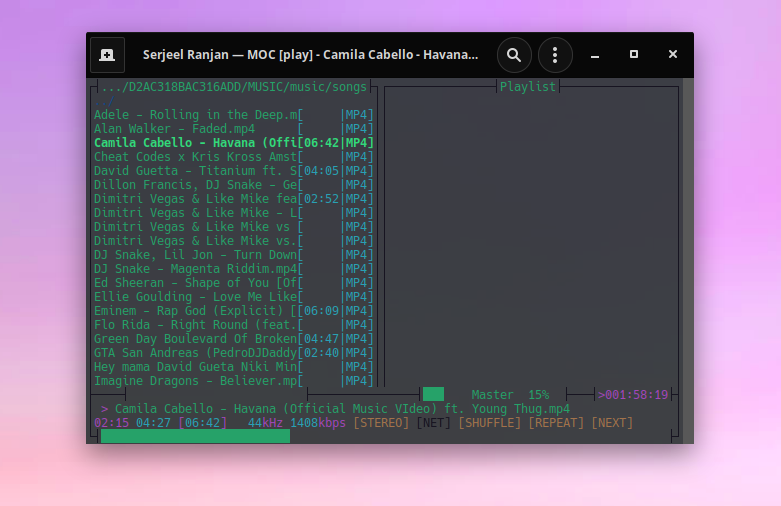</p>


## transparent-light

```
mocp -T transparent-light 
```
<p align="center">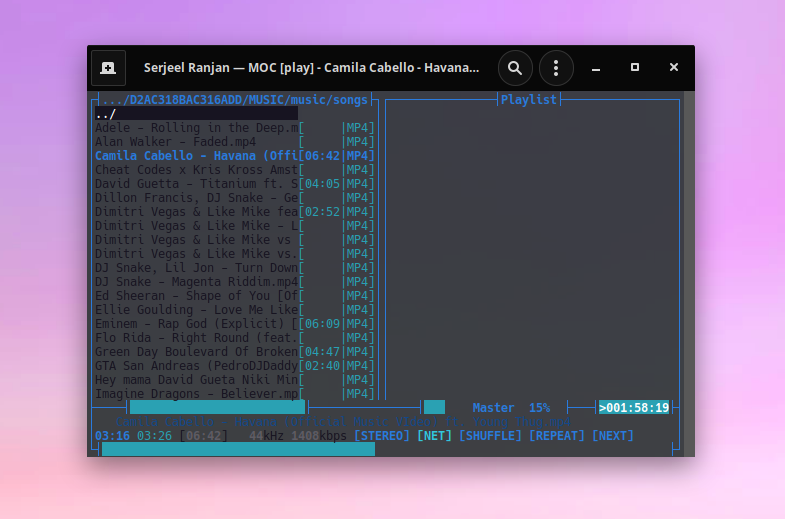</p>

## tty

```
mocp -T tty 
```
<p align="center">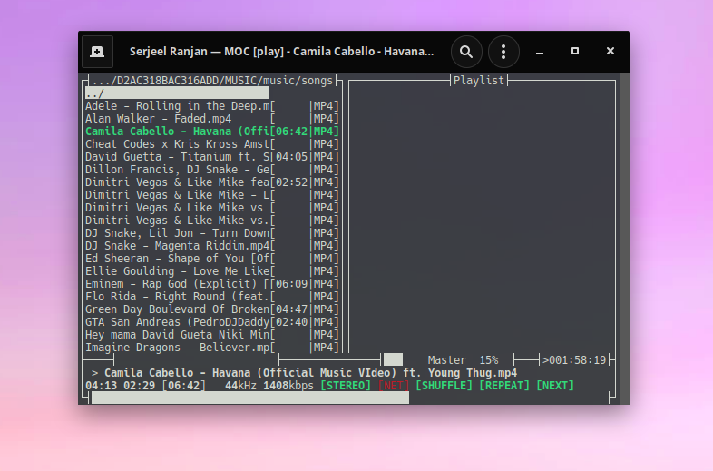</p>

## variant_red

```
mocp -T variant_red 
```
<p align="center">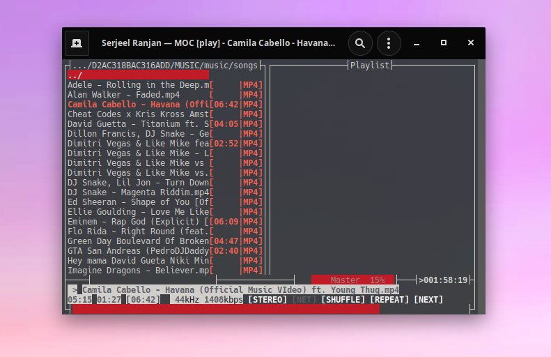</p>


